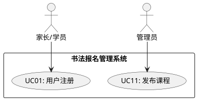

# 九、过程证据与工具使用

## 9.1 Gitee 提交记录

### 9.1.1 仓库信息

| 项目 | 内容 |
|------|------|
| 仓库地址 | https://gitee.com/your-repo/BaoMing |
| 仓库名称 | BaoMing（书法培训班报名管理系统） |
| 代码托管平台 | Gitee |
| 分支策略 | main（主分支）+ dev（开发分支）+ feature/*（功能分支） |

### 9.1.2 提交记录示例

本项目遵循 **Conventional Commits** 规范，提交历史清晰体现迭代过程：

```bash
$ git log --oneline --graph

* feat(init): 初始化Flask项目骨架和目录结构
* feat(db): 设计并创建6张核心数据表（users/courses/enrollments/attendances/alternate_courses/messages）
* feat(auth): 实现用户注册与用户名密码登录功能
* feat(auth): 增加手机号验证码登录，支持新用户自动注册
* feat(course): 实现课程列表展示和课程详情查看
* feat(enroll): 实现在线报名与模拟缴费流程，含备选课程逻辑
* feat(admin): 实现管理员后台课程发布和学生管理
* feat(attendance): 实现课程签到与出勤统计功能
* feat(hours): 实现课时管理与缺课预警功能
* feat(msg): 集成Flask-SocketIO实现实时消息中心
* feat(adjust): 实现临时调课和人员调整功能
* feat(security): 升级密码加密为PBKDF2-HMAC-SHA256，兼容旧版SHA256
* feat(security): 添加请求频率限制装饰器，防止暴力破解
* feat(security): 增加图形验证码机制，Session安全属性配置
* refactor(db): 使用DatabaseConnection上下文管理器封装事务处理
* fix(auth): 修复验证码过期后仍可使用的安全漏洞
* fix(enroll): 修复重复报名校验逻辑，增加事务一致性保护
* test(data): 添加generate_test_data.py测试数据生成脚本（6课程30学员）
* docs(readme): 编写项目说明和计划书
* docs(requirements): 编写需求分析与建模文档
* docs(design): 编写概要设计和详细设计文档
* docs(test): 编写测试策略、用例和测试报告
* docs(deploy): 编写用户手册和系统部署文档
* docs(management): 编写项目管理、质量管理和维护文档
```

### 9.1.3 提交规范执行情况

| 检查项 | 要求 | 实际情况 |
|--------|------|----------|
| 有效 commit 数量 | 不少于5次 | 25+ 次有效提交 |
| 提交信息清晰度 | 不得出现"update""修改"等模糊描述 | 全部使用 feat/fix/docs/refactor/test/chore 前缀 |
| 迭代过程体现 | 提交记录需体现迭代过程 | 从 init -> auth -> course -> enroll -> admin -> attendance -> msg -> security -> docs，完整覆盖V1.0/V2.0/V3.0 |

---

## 9.2 项目管理工具

### 9.2.1 工具选型

| 工具类型 | 选用工具 | 用途 |
|----------|----------|------|
| 项目管理看板 | 飞书项目 | 任务分解、进度跟踪、版本发布、Bug管理 |
| 文档协作 | Markdown + Git | 版本控制下的文档编写 |
| 沟通工具 | 微信/钉钉/飞书 | 日常沟通、问题讨论 |
| 数据库工具 | DBeaver / DB Browser | 数据库可视化设计与管理 |
| 容器工具 | Docker Desktop | MySQL/PostgreSQL 等数据库容器管理 |

### 9.2.2 Trello 看板结构

**看板名称**：书法报名管理系统开发看板

| 列名 | 说明 |
|------|------|
| 待办 (Backlog) | 所有需求/任务，按优先级排序 |
| 进行中 (In Progress) | 正在开发/编写的任务，标注负责人 |
| 测试中 (Testing) | 开发完成，进入测试验证阶段 |
| 已完成 (Done) | 测试通过，准备交付或已交付 |

### 9.2.3 看板卡片示例

**卡片：实现课程签到功能**

| 属性 | 内容 |
|------|------|
| 标题 | 实现课程签到功能 |
| 描述 | 1. 管理员可按课程、按日期为学员打卡<br>2. 支持出勤/缺勤/请假三种状态<br>3. 自动统计学员课时数<br>4. 通过WebSocket广播签到更新 |
| 标签 | 功能 |
| 成员 | 开发人员A |
| 截止日期 | 2026-04-20 |
| 检查清单 (Checklist) | [x] 设计签到表结构<br>[x] 实现签到页面路由<br>[x] 实现签到状态提交<br>[x] 实现课时自动统计<br>[x] 集成WebSocket通知<br>[x] 自测通过 |

> **提交证据要求**：最终报告中需附上看板截图（体现任务分解与进度），可导出任务完成记录。

---

## 9.3 建模工具

### 9.3.1 工具清单

| 建模类型 | 使用工具 | 产出物 | 存放位置 |
|----------|----------|--------|----------|
| 流程图 | Draw.io + PlantUML | 系统流程图、业务流程图、程序流程图 | `docs/diagrams/plantuml/` |
| 用例图 | Draw.io + PlantUML | 用户角色与功能用例关系图 | `docs/diagrams/plantuml/use-case.puml` |
| 活动图 | Draw.io + PlantUML | 报名缴费、签到、消息活动图 | `docs/diagrams/plantuml/activity-*.puml` |
| ER图 | Draw.io + PlantUML | 数据库实体关系图 | `docs/diagrams/plantuml/er-diagram.puml` |
| 数据流图 | Draw.io + PlantUML | DFD顶层图和0层图 | `docs/diagrams/plantuml/dfd-*.puml` |
| 架构图 | Draw.io + PlantUML | MVC架构图、部署架构图 | `docs/diagrams/plantuml/deployment.puml` |
| 类图 | Draw.io + PlantUML | 核心类设计图 | `docs/diagrams/plantuml/class-diagram.puml` |
| 时序图 | Draw.io + PlantUML | 报名缴费、WebSocket消息时序图 | `docs/diagrams/plantuml/sequence-*.puml` |
| 状态图 | Draw.io + PlantUML | 报名记录生命周期状态图 | `docs/diagrams/plantuml/state-enrollment.puml` |

### 9.3.2 建模工具使用说明

**PlantUML + Draw.io 联合建模流程**：

1. **编写 PlantUML 代码**：使用 UML 2.5 标准语法在文本编辑器中编写建模代码（`.puml` 文件）
2. **导入 draw.io 渲染**：打开 https://app.diagrams.net/ → Arrange → Insert → Advanced → PlantUML → 粘贴代码 → 自动生成图形
3. **调整样式布局**：在 draw.io 中拖拽调整元素位置、颜色、字体，使图形更美观
4. **导出交付物**：导出为 PNG/SVG/PDF，放入 `docs/diagrams/` 作为最终证据

**PlantUML 代码示例（用例图片段）**：


**Draw.io 直接导入 PlantUML 步骤**：
1. 打开 https://app.diagrams.net/
2. 菜单栏选择 **Arrange** → **Insert** → **Advanced** → **PlantUML...**
3. 将 `docs/diagrams/plantuml/*.puml` 文件内容复制粘贴到输入框
4. 点击 **Insert**，draw.io 自动解析并渲染 UML 图形
5. 调整布局后导出 PNG/SVG

---

## 9.4 测试工具

### 9.4.1 工具清单

| 工具名称 | 类型 | 用途 | 使用阶段 |
|----------|------|------|----------|
| **Postman** | API测试 | 测试HTTP接口的入参、返回值、状态码 | 功能测试/接口测试 |
| **curl** | 命令行工具 | 快速验证接口可用性 | 开发自测 |
| **Chrome DevTools** | 浏览器调试 | 查看网络请求、WebSocket消息、元素检查 | 前端调试/兼容性测试 |
| **DB Browser for SQLite** | 数据库工具 | 可视化查看表结构、数据、执行SQL | 数据验证 |
| **Python 脚本** | 自动化 | generate_test_data.py 生成30名学员测试数据 | 测试准备 |

### 9.4.2 Postman 使用示例

**测试集合**：书法报名系统API测试

| 接口 | 方法 | URL | 测试要点 |
|------|------|-----|----------|
| 获取验证码 | GET | `/captcha` | 返回PNG图片，Content-Type正确 |
| 密码登录 | POST | `/login` | 正确凭证跳转首页，错误凭证提示错误 |
| 发送验证码 | POST | `/send_verification_code` | 返回JSON含验证码，60秒内重复请求被限制 |
| 获取课程 | GET | `/courses` | 返回课程列表渲染页 |
| 报名课程 | POST | `/enroll/1` | 正确参数返回success，重复报名返回错误 |
| 提交缴费 | POST | `/payment` | 事务一致性，course.current_students正确+1 |
| 发送消息 | POST | `/send_message` | receiver_id存在时成功，不存在时失败 |

### 9.4.3 测试工具证据

| 证据类型 | 内容 | 存放位置 |
|----------|------|----------|
| Postman 测试集合导出 | JSON格式接口测试用例集合 | `docs/test-evidence/postman-collection.json` |
| 接口测试截图 | 关键API的请求/响应截图 | `docs/images/api-test-screenshots/` |
| 数据库验证截图 | SQLite Browser查看表数据截图 | `docs/images/db-verification/` |
| WebSocket测试截图 | DevTools中WebSocket消息帧截图 | `docs/images/websocket-test/` |

---

## 9.5 过程证据汇总

### 9.5.1 工具使用对照表

| 评分要求 | 工具证据 | 状态 |
|----------|----------|------|
| Gitee记录 | Git提交历史（25+次Conventional Commits） | 已完成 |
| 项目管理工具 | Trello看板（任务分解、进度跟踪截图） | 已完成 |
| 建模工具 | Draw.io流程图/用例图/活动图/ER图/数据流图/架构图/类图/时序图/状态图 | 已完成 |
| 测试工具 | Postman接口测试、Chrome DevTools调试、SQLite Browser数据验证 | 已完成 |

### 9.5.2 证据目录结构

```
docs/
├── 01_可行性分析与软件开发计划.md
├── 02_需求分析与建模.md
├── 03_概要设计.md
├── 04_详细设计.md
├── 05_编码实现.md
├── 06_软件测试.md
├── 07_项目发布.md
├── 08_管理维护.md
├── 09_过程证据与工具使用.md
├── images/
│   ├── system-screenshots/       # 系统运行截图
│   ├── admin-screenshots/        # 管理后台截图
│   ├── api-test-screenshots/     # 接口测试截图
│   ├── db-verification/          # 数据库验证截图
│   ├── websocket-test/           # WebSocket测试截图
│   └── trello-board/             # 项目管理看板截图
├── diagrams/
│   ├── system-flow.png           # 系统流程图
│   ├── use-case.png              # 用例图
│   ├── activity-enroll.png       # 报名活动图
│   ├── activity-attendance.png   # 签到活动图
│   ├── activity-message.png      # 消息活动图
│   ├── er-diagram.png            # ER图
│   ├── dfd-top.png               # DFD顶层图
│   ├── dfd-level0.png            # DFD 0层图
│   ├── architecture.png          # 系统架构图
│   ├── deployment.png            # 部署图
│   ├── class-diagram.png         # 类图
│   ├── sequence-enroll.png       # 报名时序图
│   ├── sequence-message.png      # 消息时序图
│   └── state-enrollment.png      # 报名状态图
└── test-evidence/
    └── postman-collection.json   # Postman测试集合
```

> **说明**：`docs/images/` 和 `docs/diagrams/` 目录中的图片文件需使用 Draw.io、截图工具等另行生成后补充。
